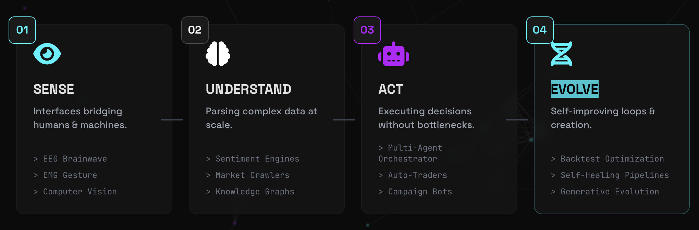

# Hi, I'm Kai Huang

**Founder @ [Universal FAW Labs](https://github.com/akaiHuang) | Creative Technologist | Ex-Ogilvy**

> Building self-evolving systems that compound value autonomously across domains.

15+ years bridging **Creative Design** and **Engineering Logic** — previously delivered campaigns for global brands like BMW, Porsche, Nike, and 7-ELEVEN through top 4A agencies. Now focused on **AI Agents**, **Generative AI**, and **Interactive 3D Experiences**.

---

## What I'm Building

I architect systems across the full spectrum — from pixels to neural signals:

**Phase 1 — Sense the world.** Interfaces that bridge humans and machines: gesture recognition from EMG and cameras, brainwave EEG interfaces, and spatial computing.

**Phase 2 — Understand the world.** Crawlers, sentiment engines, and intelligence pipelines that parse markets, brands, governments, and social platforms at scale.

**Phase 3 — Act on the world.** Multi-agent orchestrators, autonomous traders, and automation bots that execute decisions without human bottlenecks.

**Phase 4 — Evolve.** Self-testing pipelines and backtesting optimizers that let systems improve themselves, closing the loop toward autonomous value creation.

> All wrapped in stunning 3D, shader-driven aesthetics — because engineering without beauty is only half the job.

---

## Tech Stack

---

## Featured Projects

### AI Agents & Automation
| Project | Description |
|---------|-------------|
| [multi-agent-orchestrator](https://github.com/akaiHuang/multi-agent-orchestrator) | Multi-agent framework with supervisor, developer, tester & reporter roles for complex task orchestration |
| [btc-dual-ai-trader](https://github.com/akaiHuang/btc-dual-ai-trader) | Autonomous crypto trading system combining GPT-4 & Kimi K2 with five trading personas |
| [social-campaign-engine](https://github.com/akaiHuang/social-campaign-engine) | Automated social media campaign orchestration engine |
| [facebook-campaign-bot](https://github.com/akaiHuang/facebook-campaign-bot) | AI-powered Facebook campaign automation bot |
| [ai-content-scheduler](https://github.com/akaiHuang/ai-content-scheduler) | Intelligent content scheduling and publishing pipeline |
| [api-less-creative-automation](https://github.com/akaiHuang/api-less-creative-automation) | Creative automation workflows without external API dependencies |
| [self-evolving-test-pipeline](https://github.com/akaiHuang/self-evolving-test-pipeline) | Self-iterating test pipeline that evolves its own optimization logic |

### Quantitative Trading & Finance
| Project | Description |
|---------|-------------|
| [crypto-market-data-pipeline](https://github.com/akaiHuang/crypto-market-data-pipeline) | Production pipeline processing 3.1M+ crypto candlestick records for quantitative research |
| [trading-backtest-optimizer](https://github.com/akaiHuang/trading-backtest-optimizer) | Walk-forward optimization & ML-powered parameter tuning for trading strategies |
| [BTC-with-LLM](https://github.com/akaiHuang/BTC-with-LLM) | Bitcoin trading strategies powered by Large Language Models |
| [BTC-price-and-news-correlation](https://github.com/akaiHuang/BTC-price-and-news-correlation) | Correlation analysis between BTC price movements and news sentiment |

### Data Intelligence & Analytics
| Project | Description |
|---------|-------------|
| [social-intelligence-pipeline](https://github.com/akaiHuang/social-intelligence-pipeline) | AI-driven social media analysis and sentiment intelligence pipeline |
| [marketsense-ai](https://github.com/akaiHuang/marketsense-ai) | AI-powered market trend sensing and analysis dashboard |
| [brand-strategy-analyzer](https://github.com/akaiHuang/brand-strategy-analyzer) | Brand positioning and competitive strategy analysis tool |
| [brand-sentiment-dashboard](https://github.com/akaiHuang/brand-sentiment-dashboard) | Real-time brand sentiment monitoring dashboard |
| [gov-procurement-analytics](https://github.com/akaiHuang/gov-procurement-analytics) | Government procurement data analytics and visualization |
| [document-vision-analyzer](https://github.com/akaiHuang/document-vision-analyzer) | AI-powered document analysis using computer vision |
| [ai-visual-web-inspector](https://github.com/akaiHuang/ai-visual-web-inspector) | Visual web page inspection and analysis with AI |
| [SEOengine](https://github.com/akaiHuang/SEOengine) | AI-driven SEO analysis and optimization engine |

### Sensing & BCI
| Project | Description |
|---------|-------------|
| [brainwave-eeg-interface](https://github.com/akaiHuang/brainwave-eeg-interface) | iOS EEG brainwave interface with real-time FFT analysis and Metal GPU rendering |
| [emg-gesture-recognition](https://github.com/akaiHuang/emg-gesture-recognition) | Real-time 8-channel EMG gesture classification with PyTorch |
| [ai-visual-gesture-recognition](https://github.com/akaiHuang/ai-visual-gesture-recognition) | Computer vision-based gesture recognition system |

### 3D / Creative Tech
| Project | Description |
|---------|-------------|
| [ai-floorplan-to-3d](https://github.com/akaiHuang/ai-floorplan-to-3d) | 2D floorplan to interactive 3D model converter using GPT-4o Vision + Three.js |
| [monocular-3d-reconstruction](https://github.com/akaiHuang/monocular-3d-reconstruction) | 3D scene reconstruction from single monocular images |
| [rebar-3d-designer](https://github.com/akaiHuang/rebar-3d-designer) | Interactive 3D rebar structure design tool |
| [memorial-3d-experience](https://github.com/akaiHuang/memorial-3d-experience) | Immersive 3D memorial experience with WebGL |
| [pixel-art-studio](https://github.com/akaiHuang/pixel-art-studio) | Browser-based pixel art creation studio |
| [canvas-8bit-game-engine](https://github.com/akaiHuang/canvas-8bit-game-engine) | Retro 8-bit game engine built on HTML5 Canvas |
| [creative-design-system](https://github.com/akaiHuang/creative-design-system) | Modular design system for creative applications |
| [cad-intelligent-recognizer](https://github.com/akaiHuang/cad-intelligent-recognizer) | AI-powered CAD drawing recognition and analysis |

### Research & Frontier
| Project | Description |
|---------|-------------|
| [quantum-retrocausality-ai](https://github.com/akaiHuang/quantum-retrocausality-ai) | AI-assisted search for retrocausal signals in quantum entanglement simulations |
| [thermodynamic-computing-research](https://github.com/akaiHuang/thermodynamic-computing-research) | Research on thermodynamic computing paradigms |
| [thrml-python-implementation](https://github.com/akaiHuang/thrml-python-implementation) | Python implementation of thermodynamic computing models |

### Web3 & Platforms
| Project | Description |
|---------|-------------|
| [web3-sensory-fortune](https://github.com/akaiHuang/web3-sensory-fortune) | Web3-powered sensory fortune experience |
| [geo-privacy-social-platform](https://github.com/akaiHuang/geo-privacy-social-platform) | Privacy-first social platform with geo-based features |
| [cross-platform-gig-marketplace](https://github.com/akaiHuang/cross-platform-gig-marketplace) | Cross-platform marketplace for gig economy services |
| [ai-cyberpunk-blog](https://github.com/akaiHuang/ai-cyberpunk-blog) | Cyberpunk-themed AI-generated blog platform |

### Developer Tools
| Project | Description |
|---------|-------------|
| [vsmonster](https://github.com/akaiHuang/vsmonster) | VSMONSTER - Connect social platforms to VS Code Copilot |
| [ui-ux-pro-max-skill](https://github.com/akaiHuang/ui-ux-pro-max-skill) | AI skill providing design intelligence for professional UI/UX across multiple platforms |

---

## Connect

