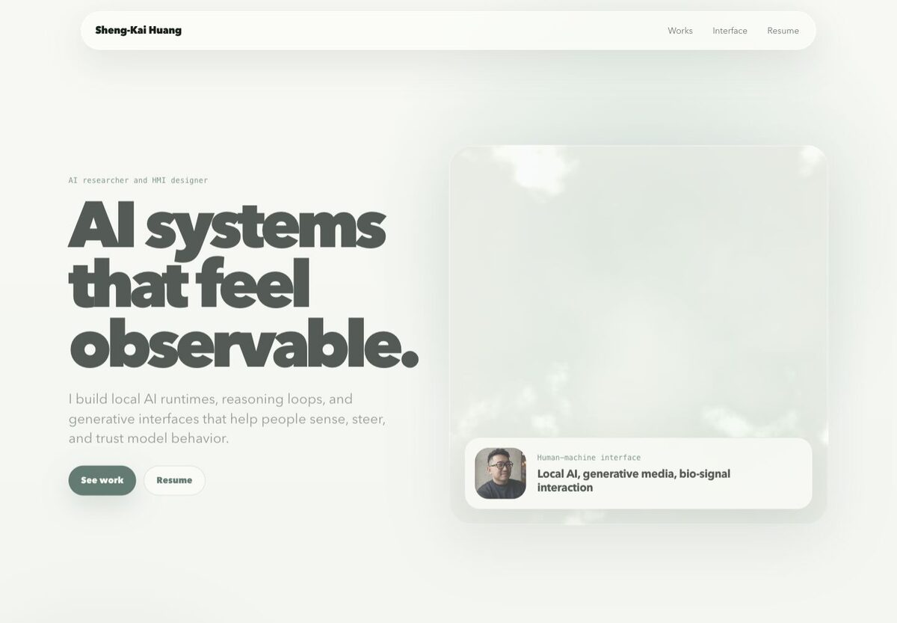
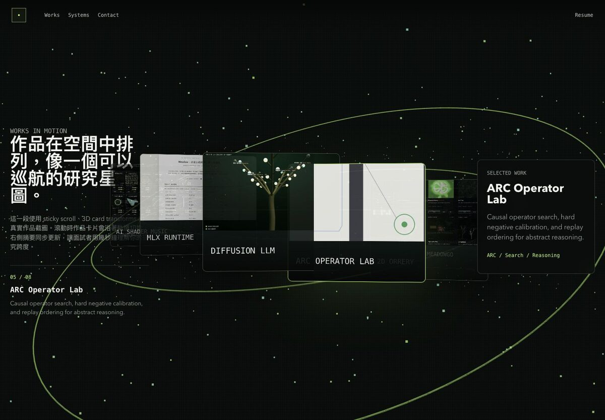
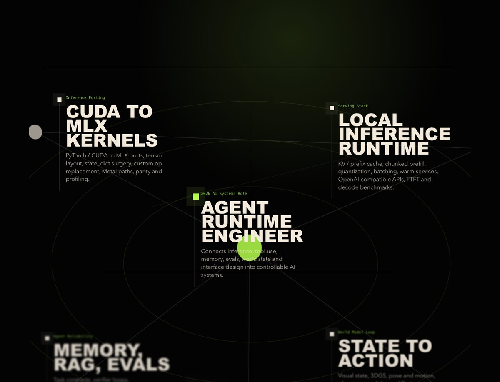

# Sheng-Kai Huang

AI runtime engineer / agent systems builder / human-machine interface designer.

I build AI systems from the runtime up: MLX and Metal model ports, local inference services, agent harnesses, memory loops, world-model experiments, and interfaces that make AI observable, steerable, and trustworthy.

Current direction: practical AGI scaffolding, Thinking Machines, local-first agents, world models, and HMI for both humans and AI.

[Portfolio](https://fawstudio.com/shengkai) / [Technical resume](https://fawstudio.com/portfolio/) / [GitHub](https://github.com/akaiHuang) / `akai@fawstudio.com`

  
  
  

  Portfolio identity / selected systems / AI runtime skill map

---

## Current Focus

| Area | What I build | Public evidence |
|---|---|---|
| MLX / Metal optimization | PyTorch/CUDA to MLX ports, tensor layout conversion, state_dict surgery, custom op replacement, parity tests, profiling | [cuda2mlx](https://github.com/akaiHuang/cuda2mlx), [mlx-sci](https://github.com/akaiHuang/mlx-sci), [mlx-heretic](https://github.com/akaiHuang/mlx-heretic) |
| Inference runtime | KV/prefix cache, chunked prefill, quantization, warm services, TTFT/decode benchmarking, OpenAI-compatible local APIs | [mlx-qwen3-tts-real-streaming](https://github.com/akaiHuang/mlx-qwen3-tts-real-streaming), [mlx-audio](https://github.com/akaiHuang/mlx-audio), [parameter-golf](https://github.com/akaiHuang/parameter-golf) |
| Agent harnesses | Task contracts, tool use, memory, verifier loops, review gates, safe executor surfaces, multi-agent coordination | [vsmonster](https://github.com/akaiHuang/vsmonster), [multi-agent-orchestrator](https://github.com/akaiHuang/multi-agent-orchestrator) |
| World models and embodied AI | 3DGS, visual state, pose and motion, afterstate candidates, compact scoring, game/robot probes | [monocular-3d-reconstruction](https://github.com/akaiHuang/monocular-3d-reconstruction), [ai-floorplan-to-3d](https://github.com/akaiHuang/ai-floorplan-to-3d), portfolio demos |
| Human-machine interface | Brainwave/music experiments, shader music, 2D/3D focus interfaces, operator surfaces for observing and steering AI | [AI_shader_Music_lab](https://github.com/akaiHuang/AI_shader_Music_lab), [brainwave-eeg-interface](https://github.com/akaiHuang/brainwave-eeg-interface), [ai-visual-web-inspector](https://github.com/akaiHuang/ai-visual-web-inspector) |

Some current Meadow and agent-runtime work is intentionally private or staged. Public repos show sanitized toolkits, benchmarks, demos, and portfolio evidence. I do not publish unreleased code, private credentials, client material, or unreviewed internal experiments.

---

## Selected Work

### CUDA2MLX

[cuda2mlx](https://github.com/akaiHuang/cuda2mlx) turns repeated PyTorch/CUDA to Apple Silicon MLX porting work into an analyzable framework.

- Covers LLM, vision, 3D, sparse ops, signal workloads, and custom Metal kernel paths.
- Includes state_dict rename, tensor layout conversion, cookbook ops, hard-case markers, and parity gates.
- Public README documents 11/11 E2E parity tests, 37/37 smoke coverage, and real repo analysis on TRELLIS, ProPainter, LaMa, InstantMesh, and LGM.

### MLX and Local Inference

I work on the layer between model capability and product reliability: runtime latency, memory pressure, cache behavior, streaming, and service lifecycle.

- [mlx-qwen3-tts-real-streaming](https://github.com/akaiHuang/mlx-qwen3-tts-real-streaming): chunk-level streaming path for Qwen3-TTS on MLX.
- [mlx-audio](https://github.com/akaiHuang/mlx-audio): STT/TTS/STS library work around Apple Silicon speech analysis.
- [mlx-sci](https://github.com/akaiHuang/mlx-sci): scientific and signal-processing kernels on MLX.

### VSMONSTER

[vsmonster](https://github.com/akaiHuang/vsmonster) explores a local agent operating system for software work.

- One chat interface orchestrates local/cloud AI agents.
- UFO plans and queues tasks, BlueMonster executes, and messaging bridges route work from phone to desktop.
- The product direction is not just "AI chat in an editor"; it is task lifecycle, review, recovery, and reusable skill accumulation.

### Shader Music Lab

[AI_shader_Music_lab](https://github.com/akaiHuang/AI_shader_Music_lab) is a browser-based generative instrument.

- WebGL shader core, WebAudio rhythm engine, and p5-style generative panels.
- 21-cell audio-visual dashboard with bidirectional coupling: rhythm drives visuals, and visual metrics feed back into sound.
- This work sits in the HMI line: interfaces that make system state felt, not hidden.

### HMI and Biosignals

- [brainwave-eeg-interface](https://github.com/akaiHuang/brainwave-eeg-interface): EEG interface experiments with real-time FFT and GPU rendering.
- [emg-gesture-recognition](https://github.com/akaiHuang/emg-gesture-recognition): 8-channel EMG gesture recognition.
- [ai-visual-web-inspector](https://github.com/akaiHuang/ai-visual-web-inspector): visual web inspection and UI decomposition with browser automation.

---

## How To Read This GitHub

The public repositories are organized into four layers:

1. **Core AI systems**: MLX, Metal, inference, local serving, speech, and parameter-constrained training.
2. **Agent harnesses**: task routing, review, verification, memory, and tool execution.
3. **World and interface demos**: 3D, visual state, generative media, HMI, and embodied probes.
4. **Archive / older product prototypes**: useful as breadth evidence, but not the center of my current AI direction.

For the most complete and current story, start with the portfolio:

- [fawstudio.com/shengkai](https://fawstudio.com/shengkai)
- [fawstudio.com/portfolio](https://fawstudio.com/portfolio/)

---

## Technical Keywords

`MLX` / `Metal` / `Apple Silicon` / `PyTorch` / `CUDA porting` / `state_dict conversion` / `tensor layout` / `custom kernels` / `parity tests` / `local inference` / `KV cache` / `chunked prefill` / `TTFT` / `streaming TTS` / `agent harness` / `tool use` / `memory verifier` / `world model` / `3DGS` / `HMI` / `WebGL` / `Three.js`

---

## Background

I started from physics and spent years in creative technology, visual systems, and interface design before moving deeper into AI runtimes and agent systems. That mix matters: I care about whether AI is fast, measurable, controllable, and also understandable to the person using it.

My current fit is strongest where product, runtime, and interface meet: AI systems that need to be built, profiled, debugged, and made usable.
